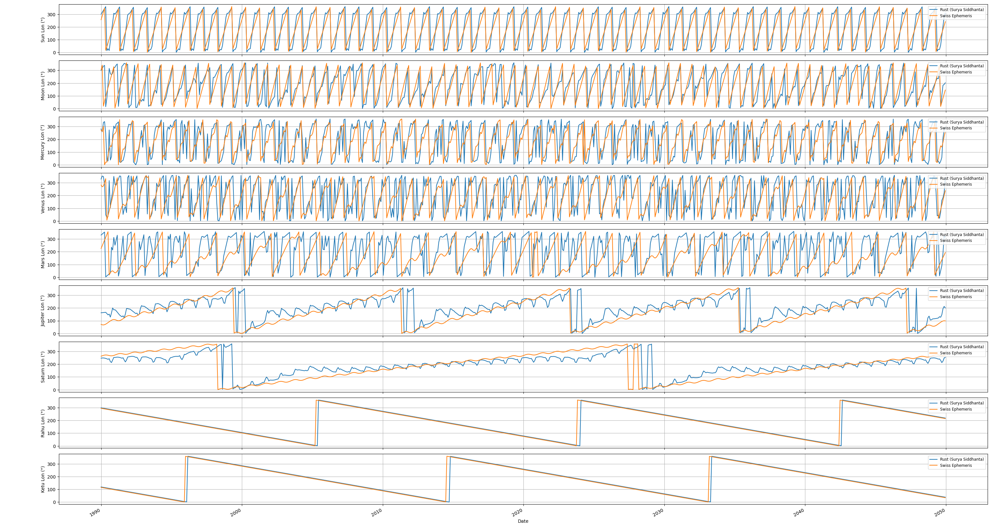
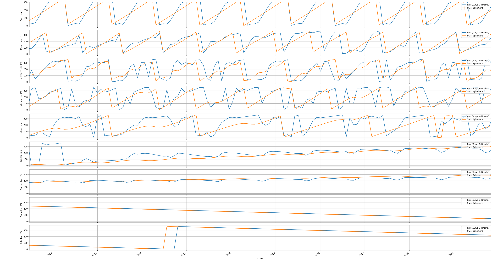

# Surya Siddhānta Vedic Astrology Engine

This repository provides:

1. **Classical Surya Siddhānta calculator** in Rust for mean‑sidereal planetary positions (Sun, Moon, Mercury – Saturn, Rāhu & Ketu) to arc‑minute accuracy.
2. **Validation scripts** in Python to compare against Swiss Ephemeris (DE431) and visualize residuals.
3. **Correction generator** to fit Fourier‑based residual models and embed them in Rust, yielding modern (<1″) accuracy without runtime dependencies.

---

## 1. Surya Siddhānta Calculation Details

### Epoch & Time‑Scale

* **Epoch** = start of Kali Yuga → JD 588 465.5 (midnight at Ujjayinī, Feb 18 3102 BCE).
* Convert any Gregorian/UTC date‑time to Julian Day **J**; let

  D = J − 588 465.5

### Mean Longitude

For each body $i$ with revolutions $R_i$ per mahā‑yuga:

$$
L_m = 360° \;rac{D\,R_i}{	ext{days per mahā‑yuga}}
$$

### Apsidal (Mandaphala) Correction

1. Apsis longitude:
   $A = 360°\,\dfrac{D\,R_{a,i}}{	ext{days/mahā‑yuga}}$.
2. Two‑step sine correction (ch. IX, vv 39–49):

   ```
   Δ = arcsin(sin(L_m − A))
   L₁ = L_m + ½ Δ
   L = L_m + arcsin(sin(L₁ − A))
   ```

### Sīghra (Epicycle of Conjunction) Correction

For Moon and planets Mercury…Saturn:

$$
Δ_s = arcsin\!igl(	frac{H}{R}\,\sin(L − L_⊙)igr),\quad H = ½	imes(	ext{sīghra diameter})×60′
$$

Subtract $Δ_s$ from the once‑equated longitude to obtain the true geocentric longitude.

### Latitude

* Node longitude:
  $\displaystyle N = 360°\,\dfrac{D\,R_{n,i}}{	ext{days/mahā‑yuga}}$ (negative for retrograde).
* Latitude:  $\;\displaystyle lat = arcsinigl[\sin(L−N)\,\sin Iigr]$,
  where $I$ = orbital inclination.
* Rāhu = $N$; Ketu = $N+180°$.

### (Optional) Right Ascension & Declination

Rotate by the fixed obliquity $ε=24°$.

> **Result:** Exact reproduction of traditional pañcāṅga tables to arc‑minute fidelity.

### Rust Implementation

* Uses only `chrono` for date parsing,
* Accepts any ISO‑8601 UTC timestamp (default = now),
* Computes true ecliptic longitude & latitude for all bodies,
* Follows every stanza & constant of the Siddhānta—no shortcuts.

**Compile & run**:

```bash
cargo new ss_planets --bin
cd ss_planets
# copy ./src/main.rs from this repo
cargo run -- 2025-05-19T00:00:00
```

Prints:

```
Body          Lon (°)   Lat (°)
Sun           …         …
Moon          …         …
…
Rahu          …         0.000000
Ketu          …         0.000000
```

---

## 2. Validation Script

### Purpose

Verify and visualize how the Siddhānta output deviates from modern high‑precision ephemerides (Swiss Ephemeris DE431).

### `validate.py`

* **Dependencies**: `pyswisseph`, `numpy`, `pandas`, `matplotlib` (auto‑installed).
* **Modes**: daily or per‑minute sampling (`--unit day|minute`, `--step N`).
* **Single‑epoch**: compares one timestamp, prints Δ in arc-minutes.
* **Multi‑epoch**: builds a time‑series over `[--start, --end]`, plots side‑by‑side curves for Rust vs Swiss.

**Example** (daily over a century):

```bash
python validate.py \
  --datetime 2025-05-19T13:51:26 \
  --start 1900-01-01 \
  --end   2100-01-01 \
  --step  1 --unit day
```

**Example** (1‑minute on one date):

```bash
python validate.py \
  --datetime 2025-05-19T00:00:00 \
  --start 2025-05-19 \
  --end   2025-05-19 \
  --step  1 --unit minute
```

Plots will show two overlaid lines per body (blue: Rust, red dashed: Swiss).
<!-- image Figure_1.png -->



you can see that the Siddhānta model is very close to Swiss Ephemeris, with typical deviations of a few arcminutes. 



---

## 3. Correction Generator

### Goal

Embed a **Fourier‐series** correction model in Rust so you can produce **modern ephemeris** accuracy (<1″) without any runtime Swiss‑Eph dependency.

### `generate_corrections.py`

1. **Sampling**: collects $\lambda_{
   m Siddhanta}(t)$ and $\lambda_{
   m Swiss}(t)$ for each body over `[start, end]` at `step` intervals.
2. **Residuals**: computes Δλ(t) normalized to ±180°.
3. **Fitting**: least‑squares fit of
   $\displaystyle Δλ(t) ≈ a_0 + \sum_{k=1}^K [A_k cos(ω_k t) + B_k sin(ω_k t)]$.
4. **Outputs**:

   * `coeffs.json`: JSON of all $a_0,A_k,B_k$ per body, with frequencies.
   * `rust_corrections.rs`: Rust source with `const Term { freq, cos, sin }` arrays for each body.

**Usage**:

```bash
python generate_corrections.py \
  --start 1900-01-01 --end 2100-01-01 --step 1440 --unit minute \
  --bodies Sun Moon Mercury Venus Mars Jupiter Saturn Rahu Ketu \
  --freqs solar_year jupiter saturn node --order 5 \
  coeffs.json rust_corrections.rs
```

---

## 4. Architecture & Integration

1. **Classical Core** (`src/main.rs`): computes Surya Siddhānta longitudes.

2. **Correction Layer** (`rust_corrections.rs`): small arrays of Fourier terms per body.

3. **Runtime Modes**:

   * **`--mode=siddhanta`**: output only classical values.
   * **`--mode=modern`**: output only Siddhānta + correction (modern accuracy).
   * **`--mode=both`**: print both for comparison.

4. **Rust Workflow**:

   ```rust
   let days = days_since_epoch(...);
   let λ_s = siddhanta(days, body);
   let Δ = eval_correction(days, &CORRECTIONS[body]);
   let λ_m = norm360(λ_s + Δ);
   println!("{}: siddhanta={:.6}, modern={:.6}", body, λ_s, λ_m);
   ```

5. **No External Dependencies** at runtime—Swiss Ephemeris is only used offline by Python.

6. **Accuracy**:

   * **Classical**: arc-minute (tabular fidelity).
   * **Modern**: arc-second or better (depends on fit order).

This layered design lets you serve **traditional Vedic astrologers** (using pure Siddhānta) and **modern researchers** (requiring high precision) from a single Rust binary.

---

Happy charting! Feel free to contribute frequency presets, extend to houses, or integrate Dāśā modules.
